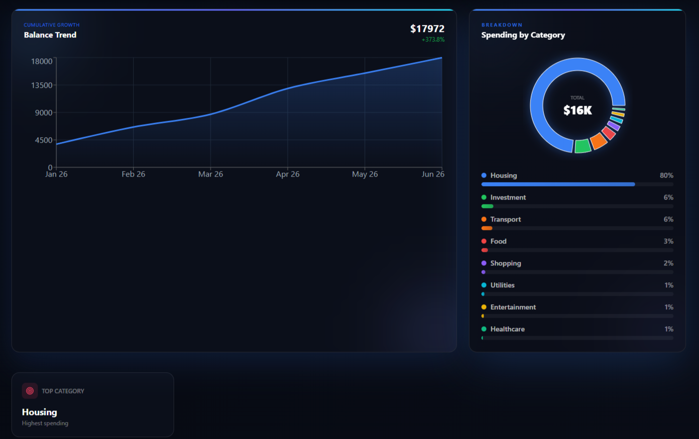
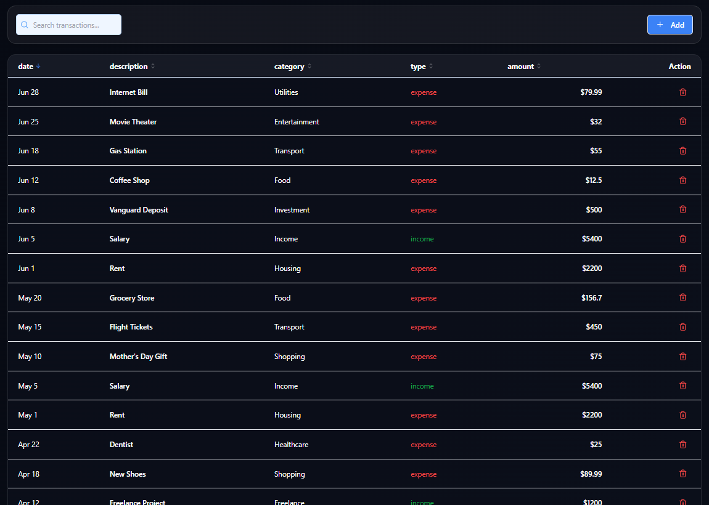
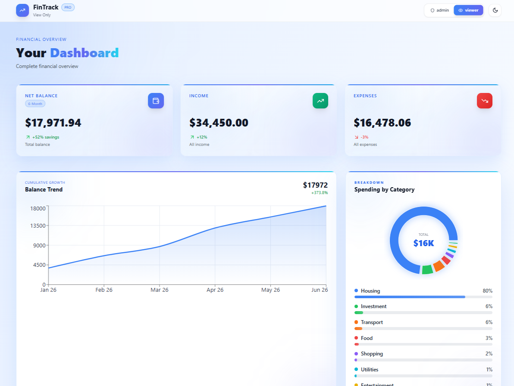
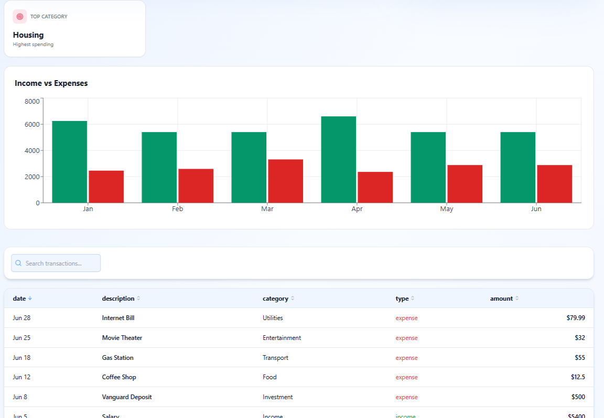

cat > README.md << 'EOF'
# 💰 Finance Dashboard

Finance Dashboard is a web application designed to help users track and understand their financial activity. The application provides a clean and interactive interface to view financial summaries, analyze spending patterns, and manage transactions efficiently.

---

## Features

- Displays total balance, income, and expenses  
- Visualizes financial data using charts (time-based and category-based)  
- Shows detailed transaction history  
- Provides search, filter, and sorting functionality  
- Simulates role-based UI (Admin / Viewer)  
- Generates basic financial insights  
- Responsive design for multiple screen sizes  

---
## 🌐 Live Demo
 https://nishika-fintrack.vercel.app/

## Libraries Used

### Frontend:
- React  
- Vite  
- Tailwind CSS  
- JavaScript  

---

## Getting Started

### Prerequisites

- Node.js  
- npm or yarn  

---

## Installation and Usage

### Step 1: Clone the Repository

git clone https://github.com/Nishika-MD/finance-dashboard-clean.git  
cd finance-dashboard-clean  

---

### Step 2: Install Dependencies

npm install  

---

### Step 3: Run the Application

npm run dev  

---

### Step 4: Use the Application

- View dashboard summary  
- Explore transactions  
- Use search and filters  
- Switch roles (Admin / Viewer)  

---

## 📸 Screenshots

### 🏠 Dashboard (Default View)

---

### 📊 Dashboard Overview (Dark Mode)

---

### 🌙 Transactions (Dark Mode)

---

### 🌞 Dashboard Overview (Light Mode)

---

### 💡 Dashboard (Light Mode Clean)

---

## Project Structure

src/  
 ├── components/  
 ├── pages/  
 ├── data/  
 └── App.jsx  

---

## Insights Implemented

- Highest spending category  
- Monthly comparison  

---

## State Management

- React Hooks (useState, useEffect)  

---

## UI and UX

- Clean design  
- Responsive layout  
- Easy navigation  

---

## License

This project is for educational purposes.
EOF

