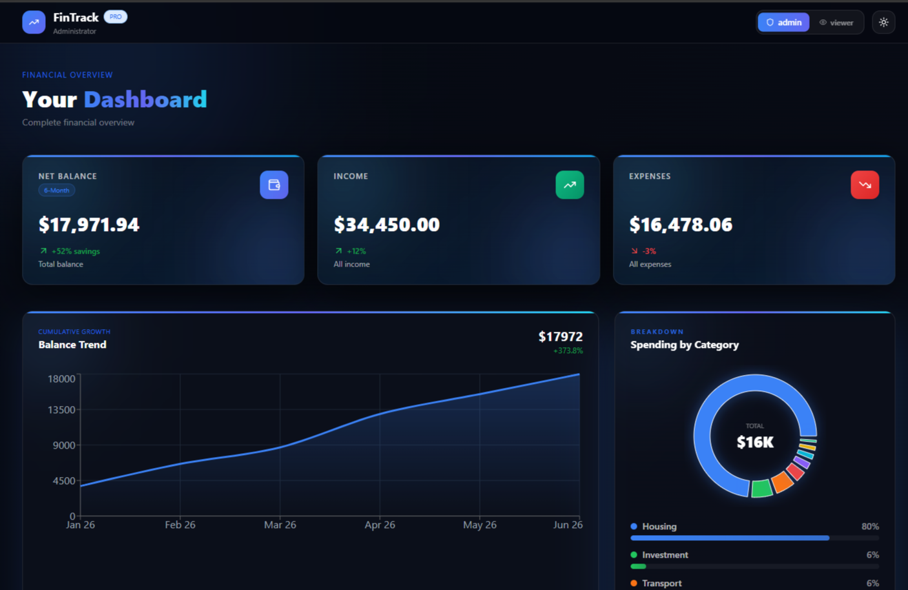

# 💰 Finance Dashboard

A modern, responsive finance dashboard designed to help users track expenses, analyze spending patterns, and understand financial activity.

---

## 📌 Objective

This project was built as part of a frontend assignment to demonstrate:
- UI/UX design skills
- Component structuring
- State management
- Data visualization techniques

---

## 🌐 Live Demo
👉 Coming Soon (Will be deployed on Vercel)

---

## 🚀 Features

- 📊 Financial summary (Total Balance, Income, Expenses)
- 📈 Time-based and category-based charts
- 🔍 Search, filtering, and sorting of transactions
- 👥 Role-based UI (Admin / Viewer)
- 📱 Responsive design
- 🌙 Dark mode support

---

## 📸 Screenshots



---

## 🛠️ Tech Stack

- React.js
- Tailwind CSS
- Vite
- JavaScript

---

## 📦 Installation

```bash
git clone https://github.com/Nishika-MD/finance-dashboard-clean.git
cd finance-dashboard-clean
npm install
npm run dev